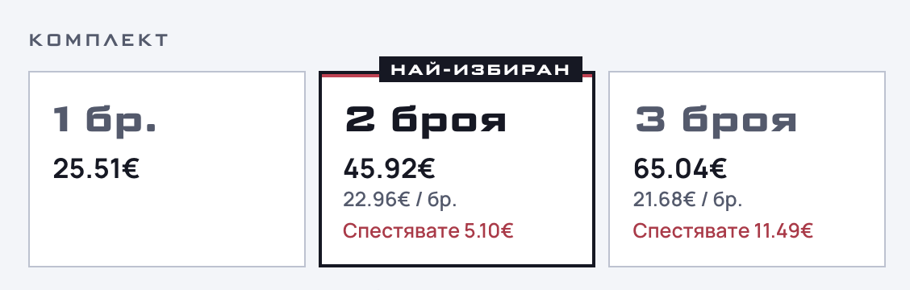

# BundleTiers – Bundle Discounts for WooCommerce



BundleTiers adds quantity bundles to your WooCommerce product page: **1 pc, 2 pcs, 3 pcs**, each with its own price, saving and badge. The discount is calculated again in the cart and saved on the order, so the price the customer sees is the price they pay.

## Key features

- Quantity tiers per product, or one set of global tiers for the whole shop
- Three discount types: **percent off**, **amount off each item**, **fixed price for the whole pack**
- Variations count together: one S and two M make a pack of three
- The discount is taken from the **current price**, so sale prices and other price changes are respected
- Exact to the cent: product page, cart, order and invoice always match
- Only the products you switch on are affected; other products keep their price
- Respects stock, sold-individually and min/max quantity rules
- Shows the bundle in the cart, checkout, mini-cart, admin order and emails
- Optional: keep coupons off bundle items
- Card background, border colour, border width, corner radius and accent colour in the settings; the font comes from your theme
- Works with HPOS and the Cart and Checkout blocks
- English source strings, Bulgarian (bg_BG) translation included

## How the tier is chosen

The tier follows the **total quantity in the cart**, not a stored choice. Changing the quantity on the cart page updates the discount straight away.

## Installation

1. Install and activate WooCommerce.
2. Copy the plugin folder to `wp-content/plugins/` and activate **BundleTiers**.
3. Go to **WooCommerce → Settings → BundleTiers** and set the default tiers.
4. Edit a product, open the **BundleTiers** tab under *Product data* and tick *Enable bundles*.

## Requirements

- WordPress 6.4+
- WooCommerce 8.5+
- PHP 7.4+

## For theme developers

- **Template:** copy `templates/bundletiers/selector.php` to `yourtheme/bundletiers/selector.php`. Keep the `bt-*` classes and the `data-bundletiers` attribute, the script uses them.
- **Radio field:** the cards post `bundletiers_tier` (the chosen quantity).
- **JS event:** `bundletiers:updated` is dispatched on the selector (it bubbles) with `detail = { qty, tier, result: { total, full, saved, unit }, base }`, all amounts in minor units (cents). Use it to show a second currency or a summary line.
- **PHP:** the action `bundletiers_loaded` runs once the plugin is ready; the filter `bundletiers_template_path` changes a template path.
- **CSS variables:** `--bt-bg`, `--bt-border`, `--bt-border-width`, `--bt-radius`, `--bt-accent`, `--bt-muted`, `--bt-gap`.

## Development

```bash
php tests/pricing-test.php          # discount maths
php tests/js-parity-test.php        # JS matches PHP (needs node)
wp eval-file wp-content/plugins/bundletiers/tests/cart-scenarios.php      # cart + order, local site only
wp eval-file wp-content/plugins/bundletiers/tests/settings-scenarios.php  # settings, local site only
```

The two `wp eval-file` scripts refuse to run anywhere except the development host named at the top of each script (change it to yours), and they restore what they change.

Coding standard: WordPress-Extra (`phpcs.xml.dist`). Files for distribution are listed in `.distignore`.
Changes are listed in [CHANGELOG.md](CHANGELOG.md).

## License

GPL-2.0-or-later. See [LICENSE](LICENSE).
